# ELK搭建部署

1.docker-compose.yaml部署

```yaml
version: '3'
services:
  elasticsearch:
    image: elasticsearch:7.13.2
    container_name: elasticsearch
    environment:
      - "cluster.name=elasticsearch" #设置集群名称为elasticsearch
      - "discovery.type=single-node" #以单一节点模式启动
      - "ES_JAVA_OPTS=-Xms512m -Xmx512m" #设置使用jvm内存大小
    volumes:
      - /mydata/elk/elasticsearch/plugins:/usr/share/elasticsearch/plugins #插件文件挂载
      - /mydata/elk/elasticsearch/data:/usr/share/elasticsearch/data #数据文件挂载
    ports:
      - 9200:9200
      - 9300:9300
  kibana:
    image: kibana:7.13.2
    container_name: kibana
    links:
      - elasticsearch:es #可以用es这个域名访问elasticsearch服务
    depends_on:
      - elasticsearch #kibana在elasticsearch启动之后再启动
    environment:
      - "elasticsearch.hosts=http://es:9200" #设置访问elasticsearch的地址
    ports:
      - 5601:5601
  logstash:
    image: logstash:7.13.2
    container_name: logstash
    volumes:
      - /mydata/elk/logstash/logstash-springboot.conf:/usr/share/logstash/pipeline/logstash.conf #挂载logstash的配置文件
    depends_on:
      - elasticsearch #kibana在elasticsearch启动之后再启动
    links:
      - elasticsearch:es #可以用es这个域名访问elasticsearch服务
    ports:
      - 4560:4560
```

创建目录 mkdir  /mydata/elk/logstash

进入 cd /mydata/elk/logstash

创造文件,可以创建多个索引。

#####  logstash-springboot.conf

```
input {
  tcp {
    mode => "server"
    host => "0.0.0.0"
    port => 4560
    codec => json_lines
  }
}
output {
  elasticsearch {
    hosts => "es:9200"
    index => "demo-spring-book-elk-%{+YYYY.MM.dd}"
  }
   elasticsearch {
    hosts => "es:9200"
    index => "demo-gateway-%{+YYYY.MM.dd}"
  }
}

```

为es设置权限

```xhell
chmod 777 /mydata/elk/elasticsearch
```

启动

```bash
docker-compose up -d
```


#### 在logstash中安装json_lines插件

```bash
# 进入logstash容器
docker exec -it logstash /bin/bash
# 进入bin目录
cd /bin/
# 安装插件
logstash-plugin install logstash-codec-json_lines
# 退出容器
exit
# 重启logstash服务
docker restart logstash
```

访问地址：http://192.168.3.101:5601

## SpringBoot应用集成Logstash

### 在pom.xml中添加logstash-logback-encoder依赖


```xml
<!--集成logstash-->
<dependency>
    <groupId>net.logstash.logback</groupId>
    <artifactId>logstash-logback-encoder</artifactId>
    <version>5.3</version>
</dependency>
```

并且设置拦截器,定义唯一得请求id

```java
package com.hjt.filter;

import lombok.extern.slf4j.Slf4j;
import org.slf4j.MDC;
import org.springframework.stereotype.Component;
import org.springframework.web.filter.OncePerRequestFilter;

import javax.servlet.FilterChain;
import javax.servlet.ServletException;
import javax.servlet.http.HttpServletRequest;
import javax.servlet.http.HttpServletResponse;
import java.io.IOException;
import java.util.UUID;

@Component
@Slf4j
public class TraceFilter extends OncePerRequestFilter {

    @Override
    protected void doFilterInternal(HttpServletRequest httpServletRequest, HttpServletResponse httpServletResponse, FilterChain filterChain) throws ServletException, IOException {
        // "traceId" 正常来说这个应该是前端传给后端得 这个只是作为后端demo得演示
        String requestNo = httpServletRequest.getHeader("request_no");
        log.info("-----输出：requesetNo,{}",requestNo);
        System.out.println("输出："+requestNo);
        MDC.put("traceid", getTraceId());
        filterChain.doFilter(httpServletRequest, httpServletResponse);
    }

    private String getTraceId() {
        long timestamp = System.currentTimeMillis();
        UUID uuid = UUID.randomUUID();
        String uniqueId = timestamp + uuid.toString().replace("-", "");
        return uniqueId;
    }
}
```

### 添加配置文件logback-spring.xml让logback的日志输出到logstash

> 注意appender节点下的destination需要改成你自己的logstash服务地址，比如我的是：192.168.3.101:4560 。

```xml
<?xml version="1.0" encoding="UTF-8"?>
<!DOCTYPE configuration>
<configuration>
    <include resource="org/springframework/boot/logging/logback/defaults.xml"/>
    <include resource="org/springframework/boot/logging/logback/console-appender.xml"/>
    <!--应用名称-->
    <property name="APP_NAME" value="demo-spring-boot-elk"/>
    <!--日志文件保存路径-->
<!--    <property name="LOG_FILE_PATH" value="${LOG_FILE:-${LOG_PATH:-${LOG_TEMP:-${java.io.tmpdir:-/tmp}}}/logs}"/>-->
    <contextName>${APP_NAME}</contextName>


    <!-- 日志最大的历史 30天 -->
    <property name="maxHistory" value="30" />
    <property name="maxFileSize" value="100MB" />

    <!-- ConsoleAppender 控制台输出日志 -->
    <appender name="STDOUT" class="ch.qos.logback.core.ConsoleAppender">
        <filter class="ch.qos.logback.classic.filter.ThresholdFilter">
            <!-- Minimum logging level to be presented in the console logs -->
            <level>INFO</level>
        </filter>
        <!-- 对日志进行格式化 -->
        <encoder>
            <pattern>
                %date{yyyy-MM-dd HH:mm:ss} | %X{traceid} | %highlight(%5p) | %green(%thread) | %boldMagenta(%logger) | %msg%n
            </pattern>
        </encoder>
    </appender>

    <!-- INFO级别日志 -->
    <!-- 滚动记录文件，先将日志记录到指定文件，当符合某个条件时，将日志记录到其他文件 RollingFileAppender -->
    <appender name="FILE"
              class="ch.qos.logback.core.rolling.RollingFileAppender">
        <filter class="ch.qos.logback.classic.filter.ThresholdFilter">
            <!-- Minimum logging level to be presented in the console logs -->
            <level>INFO</level>
        </filter>
        <!-- 最常用的滚动策略，它根据时间来制定滚动策略.既负责滚动也负责出发滚动 -->
        <rollingPolicy class="ch.qos.logback.core.rolling.TimeBasedRollingPolicy">
            <!--日志输出位置 可相对、和绝对路径 -->
            <fileNamePattern>
                log/app.%d{yyyy-MM-dd}.%i.log
            </fileNamePattern>
            <!-- 可选节点，控制保留的归档文件的最大数量，超出数量就删除旧文件假设设置每个月滚动，且<maxHistory>是6， 则只保存最近6个月的文件，删除之前的旧文件。注意，删除旧文件是，那些为了归档而创建的目录也会被删除 -->
            <maxHistory>${maxHistory}</maxHistory>
            <timeBasedFileNamingAndTriggeringPolicy class="ch.qos.logback.core.rolling.SizeAndTimeBasedFNATP">
                <maxFileSize>${maxFileSize}</maxFileSize>
            </timeBasedFileNamingAndTriggeringPolicy>

        </rollingPolicy>


        <!-- 按照固定窗口模式生成日志文件，当文件大于20MB时，生成新的日志文件。窗口大小是1到3，当保存了3个归档文件后，将覆盖最早的日志。
            <rollingPolicy class="ch.qos.logback.core.rolling.FixedWindowRollingPolicy">
            <fileNamePattern>${log_dir}/%d{yyyy-MM-dd}/.log.zip</fileNamePattern> <minIndex>1</minIndex>
            <maxIndex>3</maxIndex> </rollingPolicy> -->
        <!-- 查看当前活动文件的大小，如果超过指定大小会告知RollingFileAppender 触发当前活动文件滚动 <triggeringPolicy
            class="ch.qos.logback.core.rolling.SizeBasedTriggeringPolicy"> <maxFileSize>5MB</maxFileSize>
            </triggeringPolicy> -->

        <encoder>
            <pattern>%d{yyyy-MM-dd HH:mm:ss.SSS} [%thread] %-5level %logger - %msg%n</pattern>
        </encoder>
    </appender>

    <!--输出到logstash的appender-->
    <appender name="LOGSTASH" class="net.logstash.logback.appender.LogstashTcpSocketAppender">
        <!--可以访问的logstash日志收集端口-->
        <destination>hjt-code:4560</destination>
        <encoder charset="UTF-8" class="net.logstash.logback.encoder.LogstashEncoder"/>
    </appender>

    <logger name="java.sql.PreparedStatement" value="DEBUG" />
    <logger name="java.sql.Connection" value="DEBUG" />
    <logger name="java.sql.Statement" value="DEBUG" />
    <logger name="com.ibatis" value="DEBUG" />
    <logger name="com.ibatis.common.jdbc.SimpleDataSource" value="DEBUG" />
    <logger name="com.ibatis.common.jdbc.ScriptRunner" level="DEBUG" />
    <logger name="com.ibatis.sqlmap.engine.impl.SqlMapClientDelegate"
            value="DEBUG" />
    <logger name="com.apache.ibatis" level="TRACE" />


    <root level="INFO">
        <appender-ref ref="STDOUT"/>
        <appender-ref ref="LOGSTASH"/>
        <appender-ref ref="FILE"/>
    </root>
</configuration>

```

### 运行Springboot应用

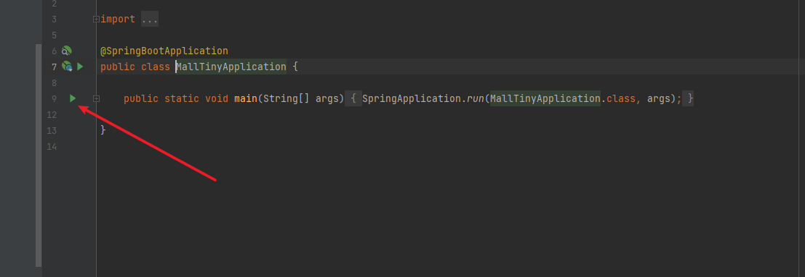

kibana中配置

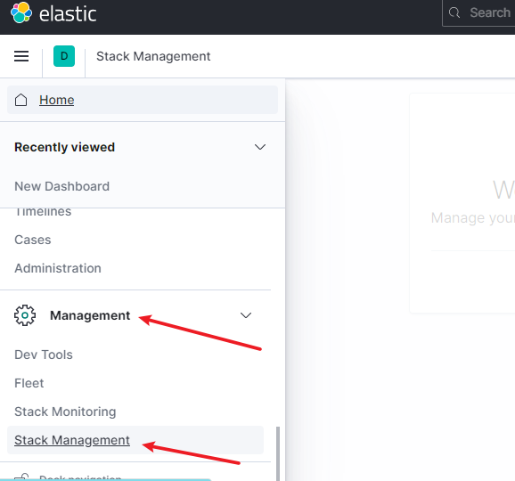

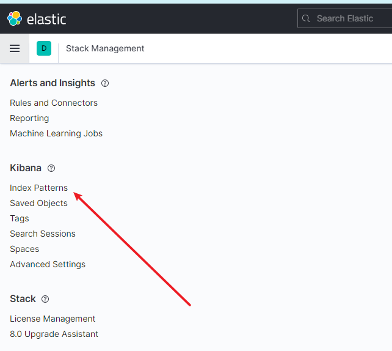

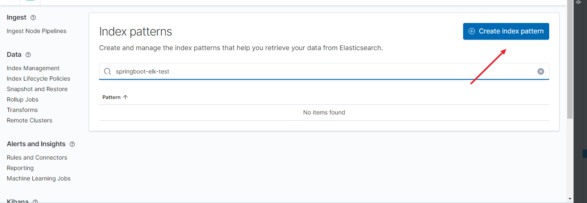

回头看看我们索引的配置

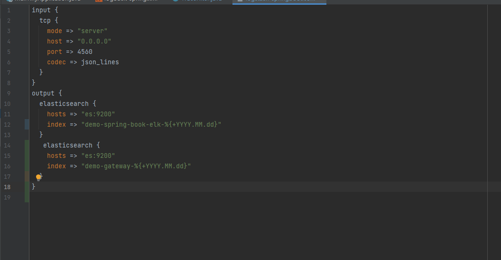

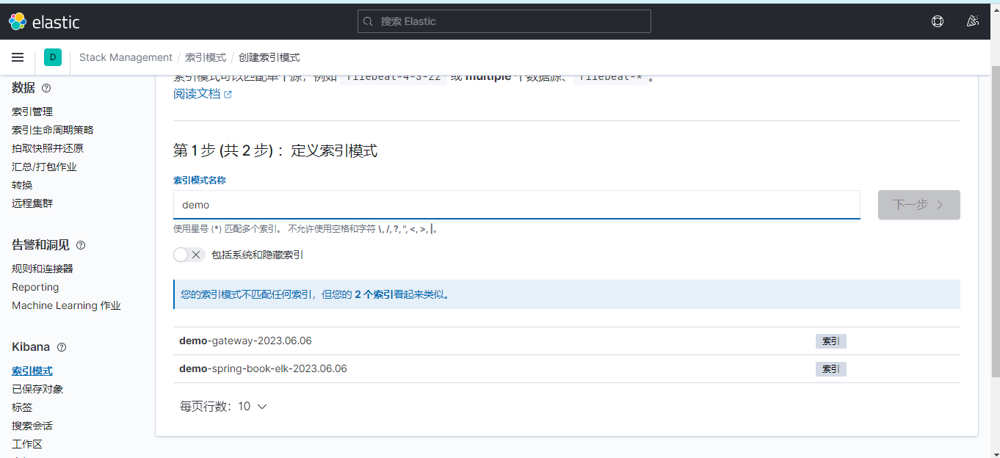

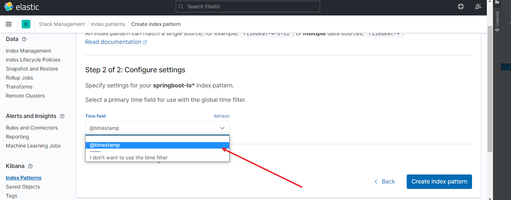

创建成功

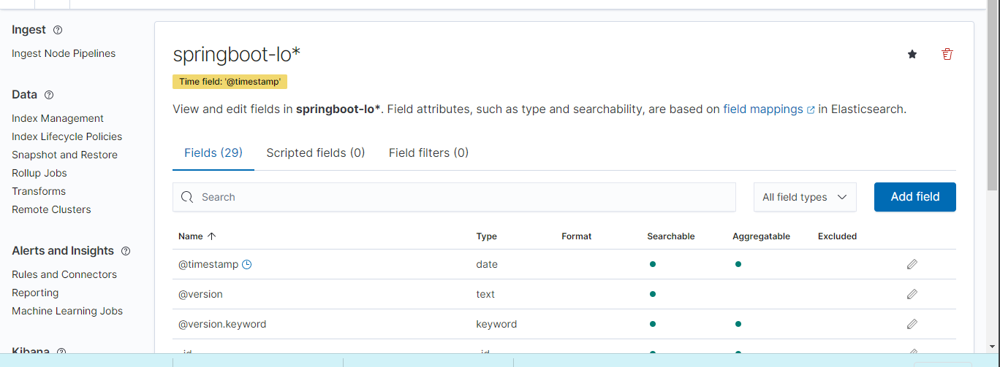

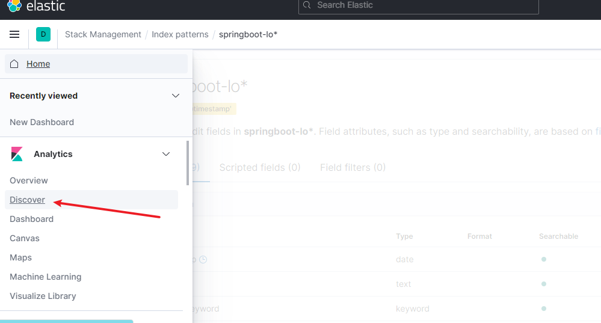

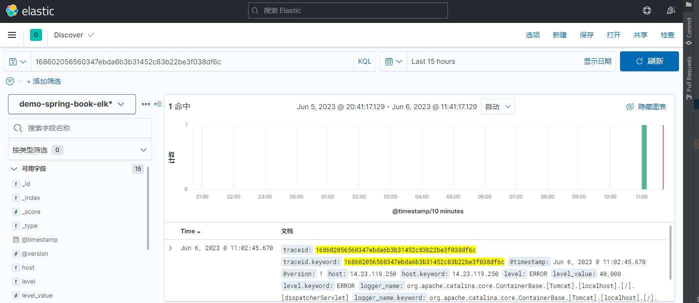

## 2.Kibana设置中文

进入容器

```
docker exec -it kibana /bin/bash
```

进入config目录，修改kibana.yml配置

增加配置文件

```
i18n.locale: "zh-CN"
```

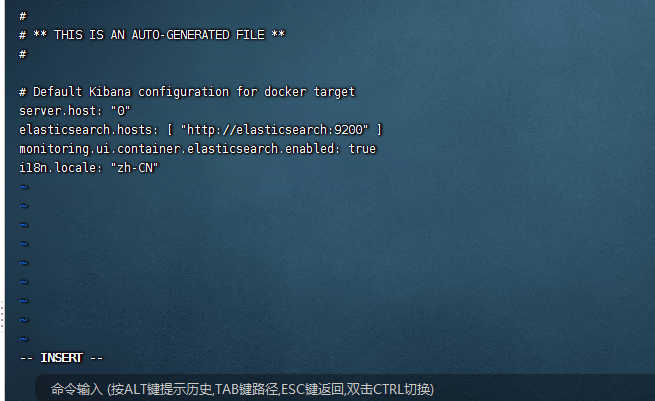

保存退出，并重启容器。