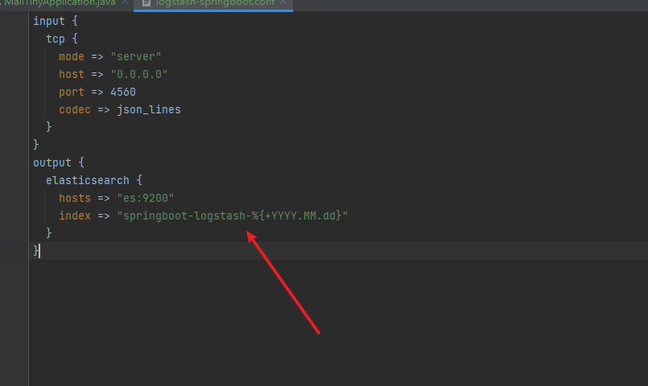
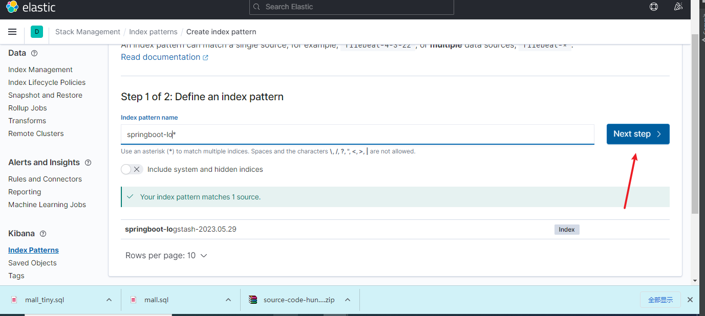
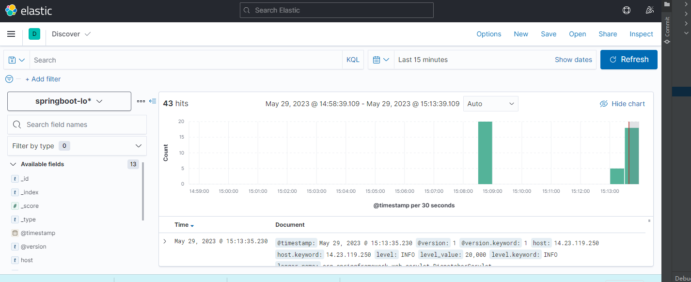

# ELK搭建部署

1.docker-compose.yaml部署

```yaml
version: '3'
services:
  elasticsearch:
    image: elasticsearch:7.13.2
    container_name: elasticsearch
    environment:
      - "cluster.name=elasticsearch" #设置集群名称为elasticsearch
      - "discovery.type=single-node" #以单一节点模式启动
      - "ES_JAVA_OPTS=-Xms512m -Xmx512m" #设置使用jvm内存大小
    volumes:
      - /mydata/elk/elasticsearch/plugins:/usr/share/elasticsearch/plugins #插件文件挂载
      - /mydata/elk/elasticsearch/data:/usr/share/elasticsearch/data #数据文件挂载
    ports:
      - 9200:9200
      - 9300:9300
  kibana:
    image: kibana:7.13.2
    container_name: kibana
    links:
      - elasticsearch:es #可以用es这个域名访问elasticsearch服务
    depends_on:
      - elasticsearch #kibana在elasticsearch启动之后再启动
    environment:
      - "elasticsearch.hosts=http://es:9200" #设置访问elasticsearch的地址
    ports:
      - 5601:5601
  logstash:
    image: logstash:7.13.2
    container_name: logstash
    volumes:
      - /mydata/elk/logstash/logstash-springboot.conf:/usr/share/logstash/pipeline/logstash.conf #挂载logstash的配置文件
    depends_on:
      - elasticsearch #kibana在elasticsearch启动之后再启动
    links:
      - elasticsearch:es #可以用es这个域名访问elasticsearch服务
    ports:
      - 4560:4560
```

创建目录 mkdir  /mydata/elk/logstash

进入 cd /mydata/elk/logstash

创造文件

#####  logstash-springboot.conf

```
input {
  tcp {
    mode => "server"
    host => "0.0.0.0"
    port => 4560
    codec => json_lines
  }
}
output {
  elasticsearch {
    hosts => "es:9200"
    index => "springboot-logstash-%{+YYYY.MM.dd}"
  }
}
```

为es设置权限

```xhell
chmod 777 /mydata/elk/elasticsearch
```

启动

```bash
docker-compose up -d
```


#### 在logstash中安装json_lines插件

```bash
# 进入logstash容器
docker exec -it logstash /bin/bash
# 进入bin目录
cd /bin/
# 安装插件
logstash-plugin install logstash-codec-json_lines
# 退出容器
exit
# 重启logstash服务
docker restart logstash
```

访问地址：http://192.168.3.101:5601

## SpringBoot应用集成Logstash

### 在pom.xml中添加logstash-logback-encoder依赖


```xml
<!--集成logstash-->
<dependency>
    <groupId>net.logstash.logback</groupId>
    <artifactId>logstash-logback-encoder</artifactId>
    <version>5.3</version>
</dependency>
```

### 添加配置文件logback-spring.xml让logback的日志输出到logstash

> 注意appender节点下的destination需要改成你自己的logstash服务地址，比如我的是：192.168.3.101:4560 。

```xml
<?xml version="1.0" encoding="UTF-8"?>
<!DOCTYPE configuration>
<configuration>
    <include resource="org/springframework/boot/logging/logback/defaults.xml"/>
    <include resource="org/springframework/boot/logging/logback/console-appender.xml"/>
    <!--应用名称-->
    <property name="APP_NAME" value="mall-admin"/>
    <!--日志文件保存路径-->
    <property name="LOG_FILE_PATH" value="${LOG_FILE:-${LOG_PATH:-${LOG_TEMP:-${java.io.tmpdir:-/tmp}}}/logs}"/>
    <contextName>${APP_NAME}</contextName>
    <!--每天记录日志到文件appender-->
    <appender name="FILE" class="ch.qos.logback.core.rolling.RollingFileAppender">
        <rollingPolicy class="ch.qos.logback.core.rolling.TimeBasedRollingPolicy">
            <fileNamePattern>${LOG_FILE_PATH}/${APP_NAME}-%d{yyyy-MM-dd}.log</fileNamePattern>
            <maxHistory>30</maxHistory>
        </rollingPolicy>
        <encoder>
            <pattern>${FILE_LOG_PATTERN}</pattern>
        </encoder>
    </appender>
    <!--输出到logstash的appender-->
    <appender name="LOGSTASH" class="net.logstash.logback.appender.LogstashTcpSocketAppender">
        <!--可以访问的logstash日志收集端口-->
        <destination>192.168.3.101:4560</destination>
        <encoder charset="UTF-8" class="net.logstash.logback.encoder.LogstashEncoder"/>
    </appender>
    <root level="INFO">
        <appender-ref ref="CONSOLE"/>
        <appender-ref ref="FILE"/>
        <appender-ref ref="LOGSTASH"/>
    </root>
</configuration>
```

### 运行Springboot应用


kibana中配置


回头看看我们索引的配置






创建成功


