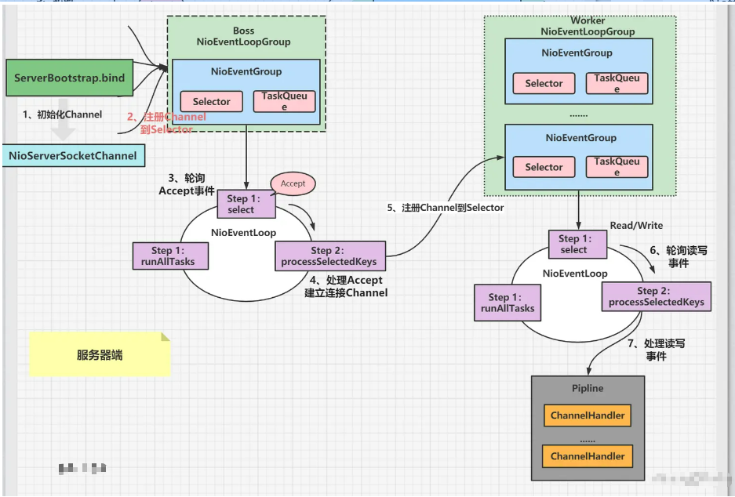
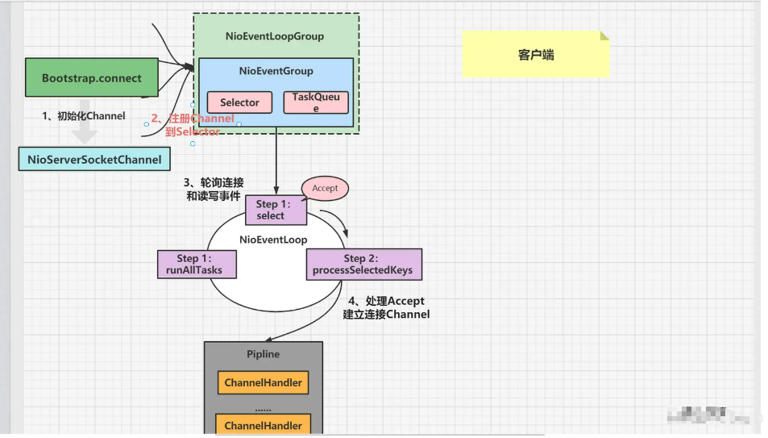
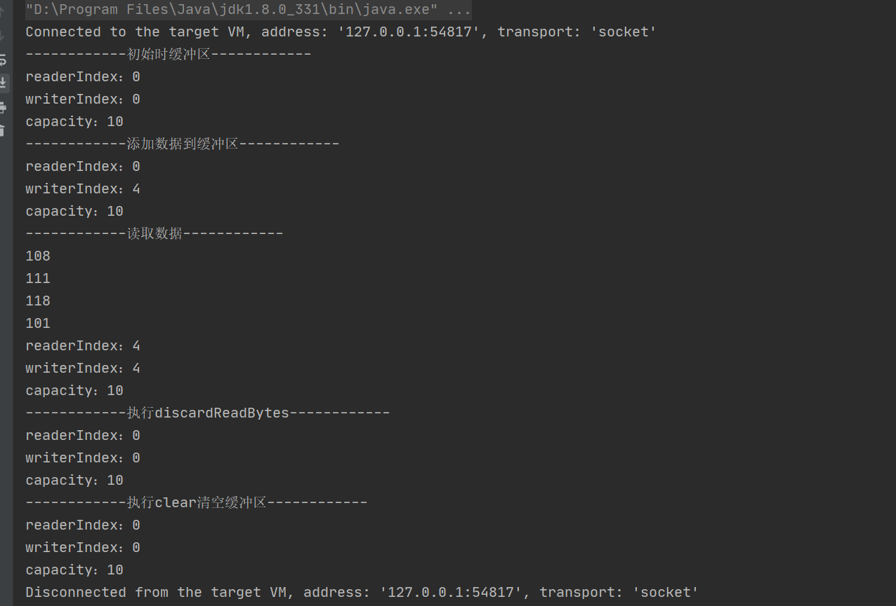
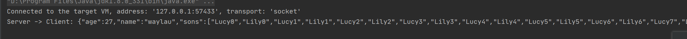
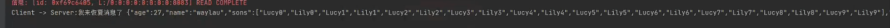

# Netty技术详解

# 一、netty是什么？

在使用netty之前，我们首先要知道netty的优势在哪，它能解决什么问题。

我们不妨直接引用netty官网上最顶部的内容：


翻译一下就是：netty是一款**异步**的**事件驱动**的网络程序框架，支持**快速地**开发可维护的**高性能**的面向协议的服务器和客户端。

注意上方加粗的关键词：

- **支持异步**是netty高效的重要支撑，在传统java API中，我们使用NIO需要较为繁琐的编码，而netty为我们封装了易于使用的API，我们甚至能够通过一行代码将整个服务由OIO转为NIO!
- **事件驱动**指的是netty处理网络消息的方式，框架内部为我们提供了完善的接口/抽象类，其中的各个方法代表了在网络传输过程中发生的各种事件，在我们编码过程中只需要完善各个方法，就可以处理各种网络通信！
- **快速开发**的快速不仅仅在于netty提供了恰当的处理网络通信的框架逻辑，更在于其内部提供了丰富的成熟的编解码器，我们只需要将它们加入我们的*pipline*，便可以轻易的处理如HTTP/HTTPS/Websocket/IMAP/ProtoBuf等等协议
- **高性能**于netty有着许多原因，包括但不限于支持NIO、零拷贝、多线程优化等。而我们只需要使用netty框架，便能轻易的享受前人给予我们的强大性能。

netty是一个优秀的NIO框架，大家对IO的第一印像应该是比较复杂，尤其是跟各种HTTP、TCP、UDP协议打交道，使用起来非常复杂。但是netty提供了对这些协议的友好封装，通过netty可以快速而且简洁的进行IO编程。netty易于开发、性能优秀，同时兼具稳定性和灵活性。如果你希望开发高性能的服务，那么使用netty总是没错的。

netty的最新版本是4.1.66.Final,事实上这个版本是官方推荐的最稳定的版本，netty还有5.x的版本，但是官方并不推荐。

如果要在maven项目中使用，可以引入下面的依赖坐标：

```xml
 <dependency>
        <groupId>io.netty</groupId>
        <artifactId>netty-all</artifactId>
        <version>4.1.66.Final</version>
    </dependency>
```


# 二、为什么使用Netty

从官网上介绍，Netty是一个网络应用程序框架，开发服务器和客户端。也就是用于网络编程的一个框架。既然是网络编程，Socket就不谈了，为什么不用NIO呢？

## 2.1 NIO的缺点

- NIO的类库和API繁杂，学习成本高，你需要熟练掌握Selector、ServerSocketChannel、SocketChannel、ByteBuffer等。
- 需要熟悉Java多线程编程。这是因为NIO编程涉及到Reactor模式，你必须对多线程和网络编程非常熟悉，才能写出高质量的NIO程序。
- 臭名昭著的epoll bug。它会导致Selector空轮询，最终导致CPU 100%。直到JDK1.7版本依然没得到根本性的解决。

## 2.2 Netty的优点

相对地，Netty的优点有很多：

- API使用简单，学习成本低。

- 功能强大，内置了多种解码编码器，支持多种协议。

- 性能高，对比其他主流的NIO框架，Netty的性能最优。

- 社区活跃，发现BUG会及时修复，迭代版本周期短，不断加入新的功能。

- Dubbo、Elasticsearch都采用了Netty，质量得到验证。

  

## 2.3 netty常见使用场景

- 互联网行业。在分布式系统中，各个节点之间需要远程服务调用，高性能的 RPC 框架必不可少，Netty 作为异步高性能的通信框架，往往作为基础通信组件被这些 RPC 框架使用。

典型的应用有：阿里分布式服务框架 Dubbo 的 RPC 框架使用 Dubbo 协议进行节点间通信，Dubbo 协议默认使用 Netty 作为基础通信组件，用于实现各进程节点之间的内部通信。

- 游戏行业。无论是手游服务端还是大型的网络游戏，Java 语言得到了越来越广泛的应用。Netty 作为高性能的基础通信组件，它本身提供了 TCP/UDP 和 HTTP 协议栈。

非常方便定制和开发私有协议栈，账号登录服务器，地图服务器之间可以方便的通过 Netty 进行高性能的通信。

- 大数据领域。经典的 Hadoop 的高性能通信和序列化组件 Avro 的 RPC 框架，默认采用 Netty 进行跨界点通信，它的 Netty Service 基于 Netty 框架二次封装实现。


netty工作架构图



### 2.3.1 Server工作流程分析：

1. server端启动时绑定本地某个端口，初始化`NioServerSocketChannel`.

2. 将自己`NioServerSocketChannel`注册到某个`BossNioEventLoopGroup`的selector上。

   - server端包含1个`Boss NioEventLoopGroup`和1个`Worker NioEventLoopGroup`，
   - `Boss NioEventLoopGroup`专门负责接收客户端的连接，`Worker NioEventLoopGroup`专门负责网络的读写
   - NioEventLoopGroup相当于1个事件循环组，这个组里包含多个事件循环NioEventLoop，每个NioEventLoop包含1个selector和1个事件循环线程。

3. `BossNioEventLoopGroup`循环执行的任务：

   1、轮询accept事件；

   2、处理accept事件，将生成的NioSocketChannel注册到某一个`WorkNioEventLoopGroup`的Selector上。

   3、处理任务队列中的任务，runAllTasks。任务队列中的任务包括用户调用`eventloop.execute或schedule`执行的任务，或者其它线程提交到该`eventloop`的任务。

4. `WorkNioEventLoopGroup`循环执行的任务：

   - 轮询`read和Write`事件
   - 处理IO事件，在NioSocketChannel可读、可写事件发生时，回调（触发）ChannelHandler进行处理。
   - 处理任务队列的任务，即 `runAllTasks`

### 2.3.2 Client工作流程图




### 2.4 Channel 接口

我们平常用到基本的 I/O 操作（bind()、connect()、read()和 write()），其本质都依赖于底层网络传输所提供的原语，在Java中就是`Socket`类。

Netty 的 Channel 接 口所提供的 API，大大地降低了直接使用`Socket` 类的复杂性。另外`Channel` 提供异步的网络 `I/O` 操作(如建立连接，读写，绑定端口)，异步调用意味着任何 `I/O` 调用都将立即返回，并且不保证在调用结束时所请求的 `I/O` 操作已完成。

在调用结束后立即返回一个 `ChannelFuture` 实例，通过注册监听器到 `ChannelFuture` 上，支持 在`I/O` 操作成功、失败或取消时立马回调通知调用方。

此外，Channel 也是拥有许多预定义的、专门化实现的广泛类层次结构的根，比如：

- `LocalServerChannel`：用于本地传输的ServerChannel ，允许 VM 通信。
- `EmbeddedChannel`：以嵌入式方式使用的 Channel 实现的基类。
- `NioSocketChannel`：异步的客户端  TCP 、Socket 连接。
- `NioServerSocketChannel`：异步的服务器端  TCP、Socket 连接。
- `NioDatagramChannel`： 异步的  UDP 连接。
- `NioSctpChannel`：异步的客户端 Sctp 连接,它使用非阻塞模式并允许将 SctpMessage 读/写到底层 SctpChannel。
- `NioSctpServerChannel`：异步的 Sctp 服务器端连接，这些通道涵盖了 UDP 和 TCP 网络 IO 以及文件 IO。

### 2.5 ChannelFuture 接口

Netty 中所有的 I/O 操作都是异步的。因为一个操作可能不会 立即返回，所以我们需要一种用于在之后的某个时间点确定其结果的方法。具体的实现就是通过 `Future` 和 `ChannelFutures`，其 `addListener()`方法注册了一个 `ChannelFutureListener`，以便在某个操作完成时（无论是否成功）自动触发注册的监听事件。

常见的方法有

- `Channel channel()`，返回当前正在进行 `IO` 操作的通道
- `ChannelFuture sync()`，等待异步操作执行完毕

# 三 netty各种API技术详解

## 3.1Buffer

Java NIO中的Buffer用于和NIO通道进行交互,数据可以从通道读入缓冲区,也可以从缓冲区写入到通道中.所以说,Buffer其实就是一块可以读写数据的内存,我们将其包装为一个Java对象来提供一系列读写操作.  Netty并没有直接使用Java NIO的Buffer实现,而是自己实现了一套Buffer框架来满足自己的业务或者性能需求.


**ByteBuf的基本原理**

读写指针的作用

不同于NIO Buffer的读写指针共用原理,ByteBuf拥有readerIndex,writerIndex两个指针.下面我们就来详细的讲解一下ByteBuf的内部原理.

```python
    +-------------------+------------------+------------------+
     | discardable bytes |  readable bytes  |  writable bytes  |
     |                   |     (CONTENT)    |                  |
     +-------------------+------------------+------------------+
     |                   |                  |                  |
     0      <=      readerIndex   <=   writerIndex    <=    capacity
```

从示意图中我们可以看出readerIndex和writerIndex最多可以将整个内容空间划分为三块:废弃区,可读区和可写区.下面我们就来看一下不同操作下的两个指针的变化.

- 在初始化状态下,假设capacity为20,readerIndex和writerIndex都为0,整个空间中只存在可写区.此时只能写,不能读,进行读操作会抛出异常.

  ```lua
    +---------------------------------------------------------+
     |             writable bytes (got more space)             |
     +---------------------------------------------------------+
     |                                                         |
  ```

  readerIndex(0) writerIndex(0)                   <=                   capacity

- 写入10个字节的数据,writerIndex指向10,readerIndex不会改变,所有内容空间中有可读区和可写区.大小都是10字节.

  ```scss
     +-------------------+------------------+------------------+
     |  readable bytes  |  writable bytes                      |
     |     (CONTENT)    |                                      |
     +--------- --------+------------------+------------------
     |                  |                                      |
   readerIndex(0) <= writerIndex(10)           <=        capacity
  ```

- 读取5个字节的内容,writerIndex不变,readerIndex加5,指向了5.此时内容空间分为了5字节的废弃区,5字节的可读区和10字节的可写区.

  +-------------------+------------------+------------------+ | discardable bytes |  readable bytes  |  writable bytes  | |                   |     (CONTENT)    |                  | +-------------------+------------------+------------------+ |                   |                  |                  | 0      <=      readerIndex(5)   <=   writerIndex(10)    <=  capacity

- 调用discardReadBytes方法后,将废弃区的内容舍弃掉,readerIndex又指向了0,writerIndex指向了5,相当于可读区和可写区整体向左平移了5个字节.

  ```lua
    +------------------+--------------------------------------+
     |  readable bytes  |    writable bytes (got more space)   |
     +------------------+--------------------------------------+
     |                  |                                      |
  ```

  readerIndex (0) <= writerIndex (5)              <=        capacity

简单代码如下：

```java
/**
 * Welcome to https://waylau.com
 */
package com.waylau.netty.demo.buffer;

import io.netty.buffer.ByteBuf;
import io.netty.buffer.Unpooled;

/**
 * ByteBuf Demo.
 * 
 * @since 1.0.0 2019年10月7日
 * @author <a href="https://waylau.com">Way Lau</a>
 */
public class ByteBufDemo {

   /**
    * @param args
    */
   public static void main(String[] args) {
      // 创建一个缓冲区
      ByteBuf buffer = Unpooled.buffer(10);
      System.out.println("------------初始时缓冲区------------");
      printBuffer(buffer);

      // 添加一些数据到缓冲区中
      System.out.println("------------添加数据到缓冲区------------");

      String s = "love";
      buffer.writeBytes(s.getBytes());
      printBuffer(buffer);

      // 读取数据
      System.out.println("------------读取数据------------");

      while (buffer.isReadable()) {
         System.out.println(buffer.readByte());
      }

      printBuffer(buffer);

      // 执行compact
      System.out.println("------------执行discardReadBytes------------");
      buffer.discardReadBytes();
      printBuffer(buffer);

      // 执行clear
      System.out.println("------------执行clear清空缓冲区------------");
      buffer.clear();
      printBuffer(buffer);

   }

   /**
    * 打印出ByteBuf的信息
    * 
    * @param buffer
    */
   private static void printBuffer(ByteBuf buffer) {
      System.out.println("readerIndex：" + buffer.readerIndex());
      System.out.println("writerIndex：" + buffer.writerIndex());
      System.out.println("capacity：" + buffer.capacity());
   }
}
```

运行结果后截图



## 3.2 Encoder(编码器)和 Decoder（解密器）

### 3.2.1 服务端Server

Netty 对于解决数据从一种特定协议格式到另一种格式的转换（如二进制字节和POJO之间地转换），提供了 codecs (编解码器) 组件来处理的。使用 Netty 的 codecs ，可以很方便地为各种不同地协议编写编解码器；

解码器：负责处理入站数据，将消息从字节或其他序列形式转成指定的消息对象；
编码器：负责处理出站数据，将消息对象转化为字节或其他序列形式；


需要重点认识以下类ByteToMessageDecoder（解密类）和MessageToByteEncoder（编码器类）

两者的主要作用是netty可以自定义解密，编码的协议（比如http协议等）

eg: 

编码

```
public class JacksonEncoder extends MessageToByteEncoder<Object> {

   @Override
   protected void encode(ChannelHandlerContext ctx, Object msg, ByteBuf out) 
         throws Exception {

      ObjectMapper mapper = JacksonMapper.getInstance();
      byte[] body = mapper.writeValueAsBytes(msg); // 将对象转换为byte
      out.writeBytes(body); // 消息体中包含我们要发送的数据
   }

}
```

解码

```
public class JacksonDecoder<T> extends ByteToMessageDecoder {

    private final Class<T> clazz;

    public JacksonDecoder(Class<T> clazz) {
        this.clazz = clazz;
   }

   @Override
   protected void decode(ChannelHandlerContext ctx, ByteBuf in,
         List<Object> out) throws Exception {
        InputStream byteBufInputStream = new ByteBufInputStream(in);
        ObjectMapper mapper = JacksonMapper.getInstance();
        out.add(mapper.readValue(byteBufInputStream, clazz));
   }

}
```

然后并把这两个解码，编码的类放在管道上

```
package com.waylau.netty.demo.codec.jackcon;

import io.netty.channel.Channel;
import io.netty.channel.ChannelInitializer;
import io.netty.channel.ChannelPipeline;


public class JacksonServerInitializer extends ChannelInitializer<Channel> {

   @Override
   protected void initChannel(Channel ch) throws Exception {
      ChannelPipeline pipeline = ch.pipeline();
      pipeline.addLast(new JacksonDecoder<JacksonBean>(JacksonBean.class));
      pipeline.addLast(new JacksonEncoder());
      pipeline.addLast(new JacksonServerHandler());
   }
}
```

客户端和服务端都需要加载相同的解密和编码的类


这里以JacksonClient 和 JacksonServer为例


先看JacksonClient代码：

```java
package com.waylau.netty.demo.codec.jackcon;

import io.netty.bootstrap.ServerBootstrap;
import io.netty.channel.ChannelFuture;
import io.netty.channel.ChannelOption;
import io.netty.channel.EventLoopGroup;
import io.netty.channel.nio.NioEventLoopGroup;
import io.netty.channel.socket.nio.NioServerSocketChannel;
import io.netty.handler.logging.LogLevel;
import io.netty.handler.logging.LoggingHandler;


public final class JacksonServer {

    static final int PORT = 8082;

    public static void main(String[] args) throws Exception {

        // Configure the server.
        //先定义一个主boss的Nio
        EventLoopGroup bossGroup = new NioEventLoopGroup(1);
        //定义一个工作的Nio
        EventLoopGroup workerGroup = new NioEventLoopGroup();
        try {
            //准备开启服务
            ServerBootstrap b = new ServerBootstrap();
            b.group(bossGroup, workerGroup)
                //配置管道Nio
             .channel(NioServerSocketChannel.class)
                
             .option(ChannelOption.SO_BACKLOG, 100)
             .childOption(ChannelOption.SO_KEEPALIVE, true)
             .handler(new LoggingHandler(LogLevel.INFO))
             .childHandler(new JacksonServerInitializer());

            // Start the server.
            ChannelFuture f = b.bind(PORT).sync();

            // Wait until the server socket is closed.
            f.channel().closeFuture().sync();
        } finally {
            // Shut down all event loops to terminate all threads.
            bossGroup.shutdownGracefully();
            workerGroup.shutdownGracefully();
        }
    }
}
```

设置JacksonServerInitializer 管道初始化

```java
package com.waylau.netty.demo.codec.jackcon;

import io.netty.channel.Channel;
import io.netty.channel.ChannelInitializer;
import io.netty.channel.ChannelPipeline;


public class JacksonServerInitializer extends ChannelInitializer<Channel> {

   @Override
   protected void initChannel(Channel ch) throws Exception {
      ChannelPipeline pipeline = ch.pipeline();
      pipeline.addLast(new JacksonDecoder<JacksonBean>(JacksonBean.class));
      pipeline.addLast(new JacksonEncoder());
      pipeline.addLast(new JacksonServerHandler());
   }
}
```


我们常常能够遇到应用程序会利用一个  `ChannelHandler` 来接收解码消息，并在这个Handler中实现业务逻辑，要写一个这样的 `ChannelHandler` ，我们只需要扩展抽象类` SimpleChannelInboundHandler< T >` 即可, 其中T类型是我们要处理的消息的Java类型。

在`SimpleChannelInboundHandler `中最重要的方法就是`void channelRead0(ChannelHandlerContext ctx, T msg)`，

我们自己实现了这个方法之后，接收到的消息就已经被解码完的消息啦。

```java
public class JacksonServerHandler extends SimpleChannelInboundHandler<Object> {

   @Override
   protected void channelRead0(ChannelHandlerContext ctx, Object obj) throws Exception {
      String jsonString = "";
      if (obj instanceof JacksonBean) {
         JacksonBean user = (JacksonBean) obj;
         ctx.writeAndFlush(user);
         jsonString = JacksonMapper.getInstance().writeValueAsString(user); // 对象转为json字符串
         System.out.println("Client -> Server: " + jsonString);
      }
   }

   @Override
   public void exceptionCaught(ChannelHandlerContext ctx, Throwable cause) {
      Channel incoming = ctx.channel();
      System.out.println("SimpleChatClient:" + incoming.remoteAddress() + "异常");
      // 当出现异常就关闭连接
      cause.printStackTrace();
      ctx.close();
   }
}
```

当然除了自定义编码，netty还提供了其他的编码

（1）对应定长法的解码器 FixedLengthFrameDecoder


Netty 在消息长度固定的场景下，对定长法进行了封装。其中FixedLengthFrameDecoder便是Netty中的固定长度解码器，它的主要作用就是对固定长度的流数据进行解码。定长法中只有解码器，没有编码器。对于编码器来说，Netty 懒得实现了，由用户自己实现，只需要在发送数据时将不足的长度补齐即可，不需要其他额外的操作。解码器使用非常简单，只需要在 childHandler 中添加一个解码器就可以了。


（2）对应明确消息边界的分隔符拆包器 DelimiterBasedFrameDecoder

通过LineBasedFrameDecoder 可以实现自动处理以指定分割符为字节流的消息的解码。 LineBasedFrameDecoder则是实现以\n以及\r\n为分隔符的数据流解码。


（3）对应消息头消息体的基于数据包长度的解码器 LengthFieldBasedFrameDecoder


（4）自定义编解码器

一般来说，上面几种方式可以解决大部分粘包以及拆包问题，但是如果涉及更复杂的编解码，开发者可以自行进行定义实现。

（1）编码器

```java
java复制代码public abstract class CustomDecoder extends ChannelInboundHandlerAdapter {
    protected abstract void decode(ChannelHandlerContext ctx, ByteBuf in, List<Object> out) 
        throws Exception;
}
```

（2）解码器

```java
java复制代码public abstract class CustomEncoder<I> extends ChannelOutboundHandlerAdapter {
    protected abstract void encode(ChannelHandlerContext ctx, I msg, ByteBuf out) 
        throws Exception;
}
```


ps:ChannelInboundHandlerAdapter 和 ` SimpleChannelInboundHandler 的区别：

在服务端编写ChannelHandler时继承的是ChannelInboundHandlerAdapter

在客户端编写ChannelHandler时继承的是SimpleChannelInboundHandler

两者的区别在于，前者不会释放消息数据的引用，而后者会释放消息数据的引用。

### 3.2.2 客户端Client

```java
package com.waylau.netty.demo.codec.jackcon;

import java.util.ArrayList;
import java.util.HashMap;
import java.util.List;
import java.util.Map;

import io.netty.bootstrap.Bootstrap;
import io.netty.channel.Channel;
import io.netty.channel.EventLoopGroup;
import io.netty.channel.nio.NioEventLoopGroup;
import io.netty.channel.socket.nio.NioSocketChannel;


public class JacksonClient {

    public static void main(String[] args) throws Exception{
//        new JacksonClient("localhost", 8082).run();
        new JacksonClient("192.168.0.56", 8083).run();
    }

    private final String host;
    private final int port;

    public JacksonClient(String host, int port){
        this.host = host;
        this.port = port;
    }

    public void run() throws Exception{
        EventLoopGroup group = new NioEventLoopGroup();
        try {
            Bootstrap bootstrap  = new Bootstrap()
                    .group(group)
                    .channel(NioSocketChannel.class)
                  .handler(new JacksonClientInitializer());
            Channel channel = bootstrap.connect(host, port).sync().channel();

            // 发送对象
         JacksonBean user = new JacksonBean();
         user.setAge(27);
         user.setName("waylau");
         List<String> sons = new ArrayList<String>();
         for (int i = 0;i <10; i++) {
            sons.add("Lucy"+i);
            sons.add("Lily"+i);
         }

         user.setSons(sons);
         Map<String, String> addrs = new HashMap<String, String>();
         for (int i = 0;i <10; i++) {
            addrs.put("001"+i, "18998366112");
            addrs.put("002"+i, "15014965012");
         }

         user.setAddrs(addrs);
         channel.write(user);
         channel.flush();
 
         // 等待连接关闭
         channel.closeFuture().sync();
        } catch (Exception e) {
            e.printStackTrace();
        } finally {
            group.shutdownGracefully();
        }

    }

}
```

客户端管道Channel初始化跟服务端一样

```java
public class JacksonClientInitializer extends
      ChannelInitializer<Channel> {
 
   @Override
   protected void initChannel(Channel ch) throws Exception {
      ChannelPipeline pipeline = ch.pipeline();
      //设置管道解密器
      pipeline.addLast(new JacksonDecoder<JacksonBean>(JacksonBean.class));
      //设置管道编码器
      pipeline.addLast(new JacksonEncoder());
      //设置管道客户端处理器
      pipeline.addLast(new JacksonClientHandler());
   }
}
```

双方建立通信后

对于客户端来说



对于服务端来说

